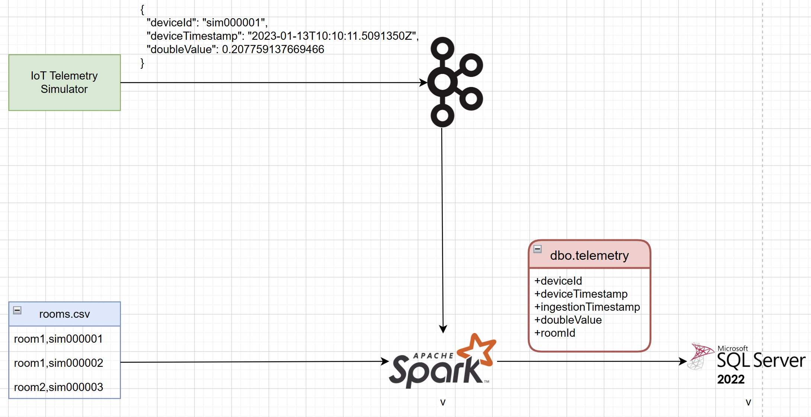
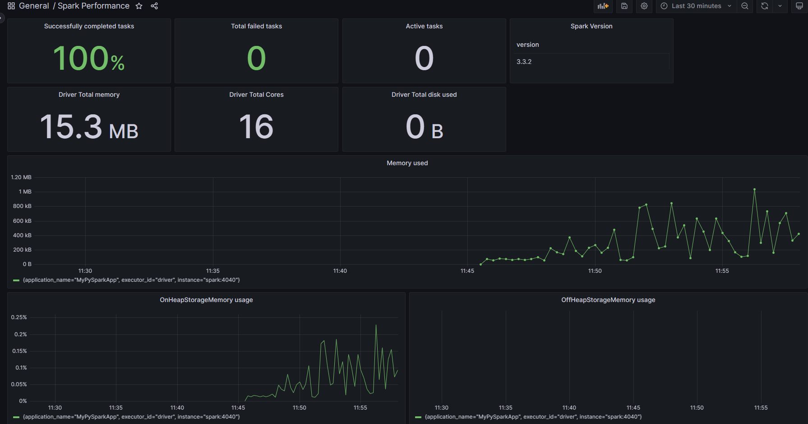

# spark-with-engineering-fundamentals

## Why?

[Apache Spark](https://spark.apache.org/docs/latest/) is a very popular open-source analytics engine for large-scale data processing. When building Spark applications as part of a production-grade solution, developers need to take care of engineering aspects such as inner dev loop, testing, CI/CD, infra-as-code and observability.

## What?

In this **work-in-progress** sample we'll demonstrate an E2E Spark data pipeline and how to tackle the above-mentioned engineering fundamentals.

## How?

The ETL scenario is based on a time series data processing pipeline. The pipeline reads synthetic data from a message broker, processes it with PySpark and writes the enriched data to a Database. The key point to note here is that the data processing logic can be shared between the cloud and local versions through the `common_lib` Wheel.

### Cloud

The IoT Telemetry Simulator is hosted in [Azure Container Instances](https://azure.microsoft.com/en-us/products/container-instances). It sends generated data to a Kafka broker, [exposed through Azure Event Hubs](https://learn.microsoft.com/en-us/azure/event-hubs/azure-event-hubs-kafka-overview).
The ETL workload is represented in a [Databricks Job](https://learn.microsoft.com/en-us/azure/databricks/workflows/jobs/jobs). This job is responsible for reading and enriching the data from sources and store the final output to an [Azure SQL DB](https://azure.microsoft.com/en-us/products/azure-sql/database/).

    

### Local

The pipeline begins with [Azure IoT Device Telemetry Simulator](https://github.com/Azure-Samples/Iot-Telemetry-Simulator) sending synthetic Time Series data to a [Confluent Community Kafka Server](https://docs.confluent.io/platform/current/platform-quickstart.html#ce-docker-quickstart). A PySpark app then processes the Time Series, applies some metadata and writes the enriched results to a SQL DB hosted in [SQL Server 2022 Linux container](https://learn.microsoft.com/en-us/sql/linux/quickstart-install-connect-docker?view=sql-server-ver16&pivots=cs1-bash).

    

## Infrastructure as Code

In the Cloud version, we provision all infrastructure with [Terraform](https://registry.terraform.io/providers/hashicorp/azurerm/latest/docs). Prior to running `terraform apply` you must ensure the [wheel](https://wheel.readthedocs.io/en/stable/) `./src/common_lib/dist/common_lib-*.whl` exists locally by executing `python3 -m build ./src/common_lib`.

In the local version, we provision and orchestrate everything with [Docker Compose](https://docs.docker.com/compose/). 
Please use the `docker compose` tool instead of the [older version](https://stackoverflow.com/a/66516826) `docker-compose`.

## Tests

- To validate that the local E2E pipeline is working correctly, we can execute the script `smoke-test.sh`. This script will send messages using the IoT Telemetry Simulator and then query the SQL DB to ensure the messages were processed correctly.
- Unit tests are available for the `common_lib` Wheel in PyTest.
- Both type of tests are also executed in the CI pipeline.

## CI/CD

GitHub Actions is used for CI/CD. The CI pipeline runs the tests and the CD pipeline deploys the Cloud infrastructure and the Spark Job.

## Observability

The local version of the solution also deploys additional containers for [Prometheus](https://prometheus.io/) and [Grafana](https://grafana.com/). The Grafana dashboard below, relies on the [Spark 3.0 metrics](https://spark.apache.org/docs/3.0.0/monitoring.html) emitted in the Prometheus format.

    

## Inner Dev Loop

[GitHub Codespaces](https://github.com/features/codespaces) are supported through the [VS Code Dev Containers](https://code.visualstudio.com/docs/devcontainers/containers). The minimum required [machine type](https://docs.github.com/en/codespaces/customizing-your-codespace/changing-the-machine-type-for-your-codespace) configuration is `4-core`.

## Team

- [Alexander Gassmann](https://github.com/Salazander)
- [Magda Baran](https://github.com/MagdaPaj)
- [Hassaan Ahmed](https://github.com/syedhassaanahmed)
